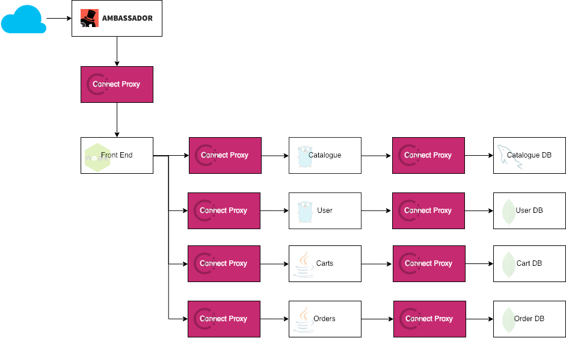

Ambassador/Consul Connect E2E Kubernetes Demo
=============================================

## Purpose

This repo contains the configuration files and scripts to set up a Kubernetes
cluster with everything you need to demo or explore Consul Connect. 
Specifically, it demonstrates the following features:

 * [Helm chart][helm-blog] to deploy Consul agents and servers with Gossip 
   encryption, the Consul Connect injector, and catalog sync between 
   Consul and Kubernetes.

 * Automatic injection of [Consul Connect sidecars][sidecars] into pods with
   a simple annotation.

 * An instance of the [HTTP echo service][echo] and its client, so you can 
   test Connect functionality.

 * An instance of the DataWire [QoTM service][qotm], also for testing.

 * Working instance of the [Weaveworks Sock Shop][sockshop] microservice demo, 
   with Consul Connect mediating all connections between services. 

 * DataWire [Ambassador][] as the L7 gateway, routing requests from the 
   Internet to the Connect proxies with full mutual TLS and using Consul
   for service discovery.

---

## Prerequisites

You should also have a Kubernetes cluster up and running already, with the
`kubectl` utility configured properly to talk to it, and a recent release of
[Helm][]. On a Mac with Homebrew, you can simply type:

    brew install kubernetes-helm kubernetes-cli

Create a Kubernetes secret with the contents of your Consul Enterprise license
key.

    kubectl create secret generic consul-ent-license --from-file=bef1b5c5-4290-a854-a34b-af1651d5d41b.hclic  

---

## Setup

#### Helm and Tiller

Run `tiller/helm-init.sh` to create a service account and install the Tiller
service.

#### Kubernetes Dashboard (optional)

If you prefer using the dashboard to the CLI, you can run 
`kube-dashboard/dashboard.sh` to install the dashboard and start a local 
proxy. You can then log into the dashboard at http://localhost:8001/api/v1/namespaces/kube-system/services/https:kubernetes-dashboard:/proxy/.

If the dashboard asks you to log in, there are helper scripts in `token-*.sh` 
that will copy an auth token onto the clipboard.

#### Consul servers and clients

The `consul/consul.sh` script uses the Consul Helm chart to deploy Consul
servers and client agents. The Helm chart does all of the following:

 * Deploy 3 Consul server pods, each with 20GB storage (currently version 
   1.4.2 OSS).

 * Deploy agent pods to each host in the cluster.

 * Deploy the `consul-k8s` pod for service catalog sync and automatic
   Consul Connect injection.

The chart can be customized in various ways by editing `consul/values.yaml`,
for example:

 * If you are testing with minikube, you should change `server.replicas` and
   `server.bootstrapExpect` to 1.

 * You can use a specific version of [Consul][consul-tags], 
   [Envoy][envoy-tags], or [`consul-k8s`][k8s-tags] by changing the 
   `image` fields.

 * You can expose the Consul UI outside the cluster by changing 
   `ui.service.type` from `NodePort` to `LoadBalancer` if you'd prefer not
   to use the `kubectl` port forwarder.

If you would rather deploy enterprise binaries instead of OSS, make the
following changes:

 * Create a secret in Kubernetes that contains your license key. See the
   comments at the top of `values.yaml` for an example.

 * Add the `-ent` tag to the end of the tag specified in `global.image`,
   e.g. `"consul:1.4.2-ent"`.

 * Set the name of your secret in `server.enterpriseLicense.secretName`
   and `server.enterpriseLicense.secretKey`. Use the commented entries
   in `values.yaml` as your guide.

If anything goes wrong with the deployment (e.g. due to syntax errors in your
`values.yaml`), you can use the `consul/clean.sh` script to clean everything
out and try again.

#### Simple HTTP echo service

Some of the Consul docs use an HTTP "echo" service and client to demonstrate
various concepts. Those can be deployed with `simple/simple.sh`. 

To test the connection between client and server, see the "Testing and Demos" 
section below.

#### Load intentions into Consul Connect

The `consul/intentions.sh` script creates a default set of intentions for
Connect to enable the demos to run:

 * Ambassador may talk to anything.

 * The `carts`, `orders`, `catalogue`, and `user` services from the Sock Shop
   demo can talk to their own databases (`carts-db`, `orders-db`, etc).

 * The Sock Shop `front-end` web server can talk to the `carts`, `orders`, 
  `catalogue`, and `user` services.

 * The HTTP echo client may talk to the echo server.

 * All other traffic is denied.

#### Sock Shop demo

Run the `sockshop/weaveworks.sh` script to deploy a version of the Sock Shop 
demo that is customized to use Consul Connect. Very few changes were actually
necessary -- this shows how easy it is to adapt your own applications to
Connect!

The changes made were as follows:

 * In the Helm chart, annotate the pods to mark them for [sidecar 
   injection][cartdb] and declare the [upstream dependencies][carts].

 * For each downstream service service, add either an [environment variable][user] 
   or a [command-line option][catalogue] to tell them to look on localhost 
   for their upstreams.

The only service that required actual code changes was the `front-end`, 
because it had the upstream service names hard-coded. I took advantage of the
environment variables created by Connect, as you can see [here][frontend].
If you remove the Connect injection, the front end will revert to its old
behavior.

#### Ambassador

Finally, deploy the Ambassador proxy by running `ambassador/ambassador.sh`. 
This will install Ambassador itself as well as the Consul Connector, which 
looks up the Consul mTLS certificates and provides them to the main
Ambassador service.

---

## Testing and Demos

#### Finding the IP address of Ambassador

As an L7 gateway, Ambassador exposes a public IP address. You'll need to know
that address to run any of the tests below. Use the command `kubectl describe 
service ambassador` and look for the "LoadBalancer Ingress". That is the
public-facing IP address of your Ambassador service. When you see 
`AMBASSADOR_IP` in the examples below, replace it with that IP address.

#### Simple HTTP echo service

The HTTP echo client pod has been injected with a proxy to connect to 
the echo server. You can verify this by inspecting the pod and looking at
the annotations:

    consul.hashicorp.com/connect-inject=true
    consul.hashicorp.com/connect-inject-status=injected
    consul.hashicorp.com/connect-service=http-echo-client
    consul.hashicorp.com/connect-service-upstreams=http-echo:1234

You'll also see that the pod contains an extra container named
`consul-connect-envoy-sidecar`. This is the proxy that carries connections
to the upstream service.

You can verify that the connection to the upstream service works by running 
a `curl` command inside the client container:

    $ kubectl exec -it http-echo-client curl localhost:1234
    "hello world"

Try changing the intention from "allow" to "deny" and the `curl` command 
stops working immediately:

    $ consul intention create -replace -deny '*' http-echo
    $ kubectl exec -it http-echo-client curl localhost:1234
    curl: (52) Empty reply from server
    command terminated with exit code 52

And of course you can allow traffic again via:

    $ consul intention create -replace -allow '*' http-echo

You can also invoke the service from Ambassador:

    $ curl http://AMBASSADOR_IP/echo/

#### Ambassador QoTM service

Ambassador provides a "Quote of the Moment" service. You can test it
by opening http://AMBASSADOR_IP/qotm/.

#### Sock Shop demo

Finally, the big enchilada! Visit http://AMBASSADOR_IP/socks/ to test it out.
The traffic flow to serve the page looks like this:

---

## Future enhancements

 - [ ] Monitoring with Prometheus
 - [ ] Outward-facing SSL/TLS with Ambassador
 - [ ] ACL bootstrapping

[sidecars]:    https://www.consul.io/docs/platform/k8s/connect.html
[sockshop]:    https://microservices-demo.github.io/
[helm]:        https://helm.sh/
[helm-blog]:   https://kubernetes.io/blog/2016/10/helm-charts-making-it-simple-to-package-and-deploy-apps-on-kubernetes/
[ambassador]:  https://www.getambassador.io/
[connector]:   https://www.getambassador.io/user-guide/consul-connect-ambassador/
[qotm]:        https://github.com/datawire/qotm
[echo]:        https://github.com/hashicorp/http-echo
[proxy]:       http://localhost:8001/api/v1/namespaces/kube-system/services/https:kubernetes-dashboard:/proxy/#!/overview?namespace=default
[consul-tags]: https://hub.docker.com/_/consul?tab=tags
[k8s-tags]:    https://hub.docker.com/r/hashicorp/consul-k8s/tags
[envoy-tags]:  https://hub.docker.com/r/envoyproxy/envoy-alpine/tags
[me]:          mailto:todd@hashicorp.com
[frontend]:    https://github.com/tradel/front-end/blob/9c32e77828993c4571ac2219843a999e6e4e12cf/api/endpoints.js#L18-L35
[cartdb]:      https://github.com/tradel/microservices-demo/blob/2bc270d61c993f8a1ae3c8a492cae504b7c3ade5/deploy/kubernetes/helm-chart/templates/cart-db-dep.yaml#L14-L15
[carts]:       https://github.com/tradel/microservices-demo/blob/2bc270d61c993f8a1ae3c8a492cae504b7c3ade5/deploy/kubernetes/helm-chart/templates/carts-dep.yaml#L14-L16
[catalogue]:   https://github.com/tradel/microservices-demo/blob/2bc270d61c993f8a1ae3c8a492cae504b7c3ade5/deploy/kubernetes/helm-chart/templates/catalogue-dep.yaml#L24
[user]:        https://github.com/tradel/microservices-demo/blob/2bc270d61c993f8a1ae3c8a492cae504b7c3ade5/deploy/kubernetes/helm-chart/templates/user-dep.yaml#L31-L32
